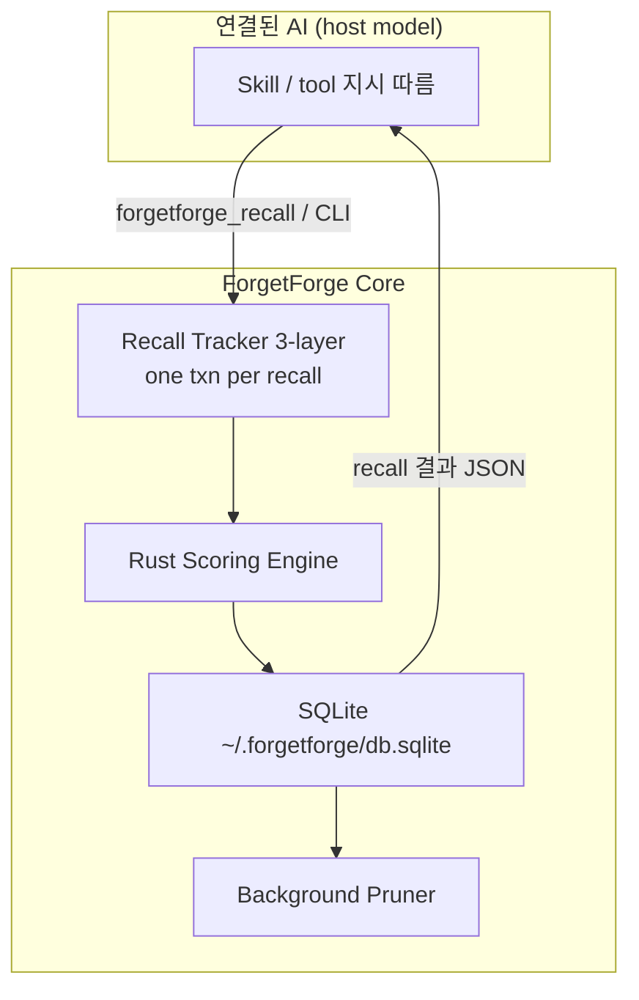

# Architecture

## 목표

에이전트 **영구 메모리 bloat**를 **회상(Recall) 중심**으로 해결합니다.  
저장 횟수가 아니라 **실제 회상 횟수**가 기억 강도를 결정합니다.

## 범용 에이전트 + Rust-First

| 계층 | 구현 |
|------|------|
| **Rust** (`forgetforge-engine`) | Retention scoring, tier decision |
| **Python** (`forgetforge`) | SQLite, recall tracker, pruner, CLI |
| **Agent surfaces** | Hermes entry point, root Codex/Claude plugin commands and skill |

## 데이터 흐름

연결된 AI는 recall 결과를 읽고 **자신의 응답 맥락에 반영**합니다. 플러그인이 별도 completion을 생성하지 않습니다.

## Tiered Memory

Public CLI/API `retention` fields are normalized to `0.0..1.0`. The Rust engine keeps its
internal `0.0..10.0` score for pruning thresholds and tier decisions.

| Tier | 조건 | 연결된 AI |
|------|------|-----------|
| **Hot** | 최근 7일 + N_r ≥ 1 | recall 결과 우선 반영 |
| **Warm-Episodic** | R ≥ 0.65 | 필요 시 recall |
| **Warm-Semantic** | R ≥ 0.80 | 장기 사실 유지 |
| **Warm-Procedural** | skill + N_r ≥ 3 | 절차·스킬 유지 |
| **Cold** | R < 0.40 or 180일 무회상 | archive, on-demand recall |

## Host 경계

- **Host**: 모델·OAuth·completion·최종 응답
- **ForgetForge**: 점수·tier·DB·archive·도구 JSON
